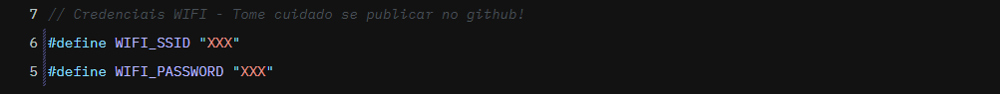
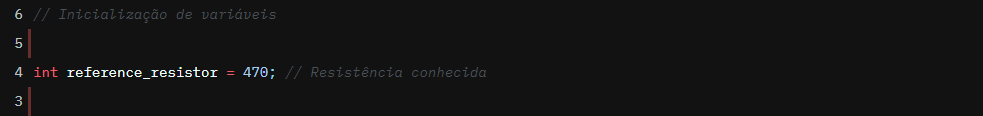

# Projeto WEBSERVER - PARTE 01 - EMBARCATECH
O objetivo desse projeto é implementar um servidor web com o Raspberry Pi Pico W utilizando a biblioteca lwIP. Este projeto implementa a leitura da do valor dos resistores a partir do conceito do divisor de tensão. Nessa primeira etapa do projeto, só é possível realizar a leitura de resistores de 4 bandas e tolerância de 5% (série e24). Na próxima parte, será possível realizar a leitura de resistores de 5 bandas (série e96).
Nesse projeto é utilizado um resistor de referência que é colocado em série com o resistor que deseja ser lido. Os dados da medida e do resistor comercial mais próximos são exibidos na página WEB hospedada no microcontrolador e que pode ser acessada por qualquer dispositivo que esteja conectado à mesma rede que o Raspberry Pi.
Para conectar o dispositivo na sua rede local é necessário informar no arquivo `main.c` o SSID e a senha da rede Wi-Fi como é exibido na imagem abaixo.

Para realizar a leitura da resistência, deve ser conectado um resistor de valor conhecido em série com o resistor que quer ser medido da seguinte forma:
- O jumper que é ligado no nó de encontro entre os dois resistores é conectado no GPIO 28;
- O jumper que é ligado na perna externa do resistor desconhecido é conectado no GND;
- O jumper que é ligado na perna externa do resistor conhecido é conectado no 3.3V.
- O valor do resistor conhecido deve ser informado no arquivo `main.c` como na imagem abaixo.

Para acessar a página WEB é necessário saber o endereço IP do Raspberry Pi. Para isso, abra o terminal serial e carregue o arquivo .uf2 para o seu dispositivo. Ao fazer isso, durante a inicialização será exibido no terminal o endereço IP. Escreva o endereço em qualquer navegador e você conseguirá acessar a página. Lembre-se de verificar se está conectado na mesma rede que o Raspberry.
